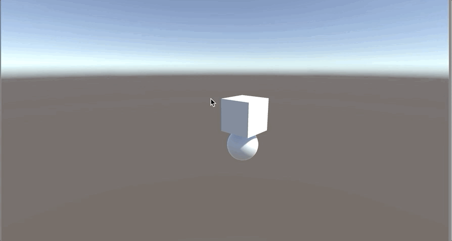
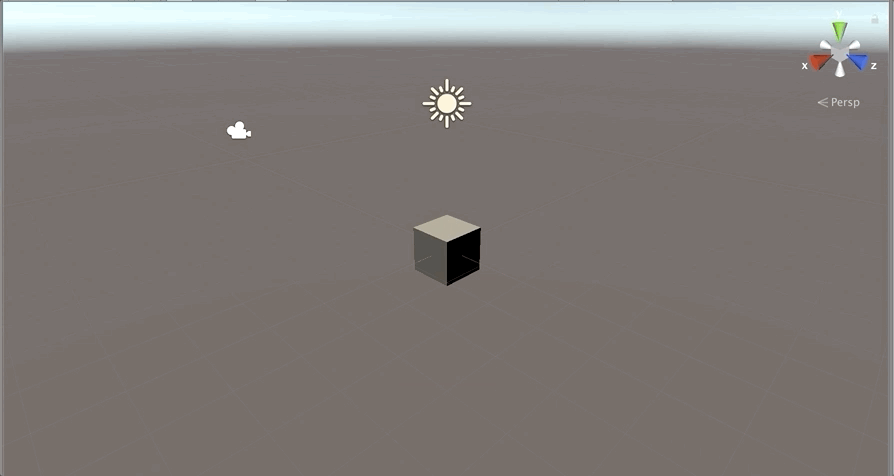

# summer-internship-2019

For learning

## What I learned

https://www.iterm2.com/

https://brew.sh/

https://en.wikipedia.org/wiki/Markdown

https://github.com/NachoForce/summer-internship-2019

## Gotchas

```bash
Akshays-MacBook-Pro:vre aks$ git push
remote: Repository not found.
fatal: repository 'https://github.com/IntrinsicSoftware/vre.git/' not found
```
This happens when the repository is read-only, meaning you can pull but cannot push to it. 

## Cloning a Repository
```bash
> git clone https://github.com/IntrinsicSoftware/vre.git
```
For 2FA, github accounts need Personal Access tokens. 


## How to Create a Pull Request
Before you create a branch, checkout master
```bash
> git checkout master
```

create a branch
```bash
> git checkout -b branch-name
```

once you create the branch, do a git status to see what files are uncommitted.
If it's a brand new branch, there will be no files to be committed.

To add your files to be staged
```bash
> git add .
```

Commit the files
```bash
> git commit -m "My commit message here"
```

Push it to github
```bash
>git push
```

If it says, "the current branch has no upstream branch.", then copy the following line and run it.
```bash
#EXAMPLE:
> git push --set-upstream origin SI2-2-hello-world-csharp
```

## C# Hello World

https://dotnet.microsoft.com/learn/dotnet/hello-world-tutorial/intro

https://docs.microsoft.com/en-us/dotnet/core/tutorials/with-visual-studio-code


<<<<<<< HEAD





=======
>>>>>>> master
I attempted to program Hello World in C# using dotnet, and found two ways to do it:
either using iTerm2 to use dotnet, or in Visual Studio Code's terminal. Both ways, once I created my App, had Hello World
preloaded as a default program, so from then, I simply had to write dotnet new console, then dotnet run, and I had successfully printed Hello World in both the iTerm2 console and the console inside Visual Studio Code. 

 # Build results
[Dd]ebug/
[Dd]ebugPublic/
[Rr]elease/
[Rr]eleases/
x64/
x86/
build/
bld/
[Bb]in/
[Oo]bj/
[Oo]ut/
msbuild.log
msbuild.err
msbuild.wrn
